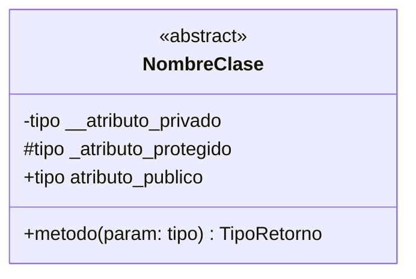
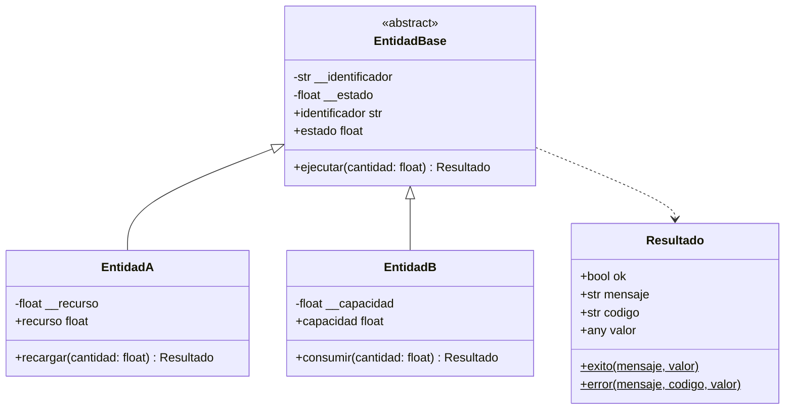
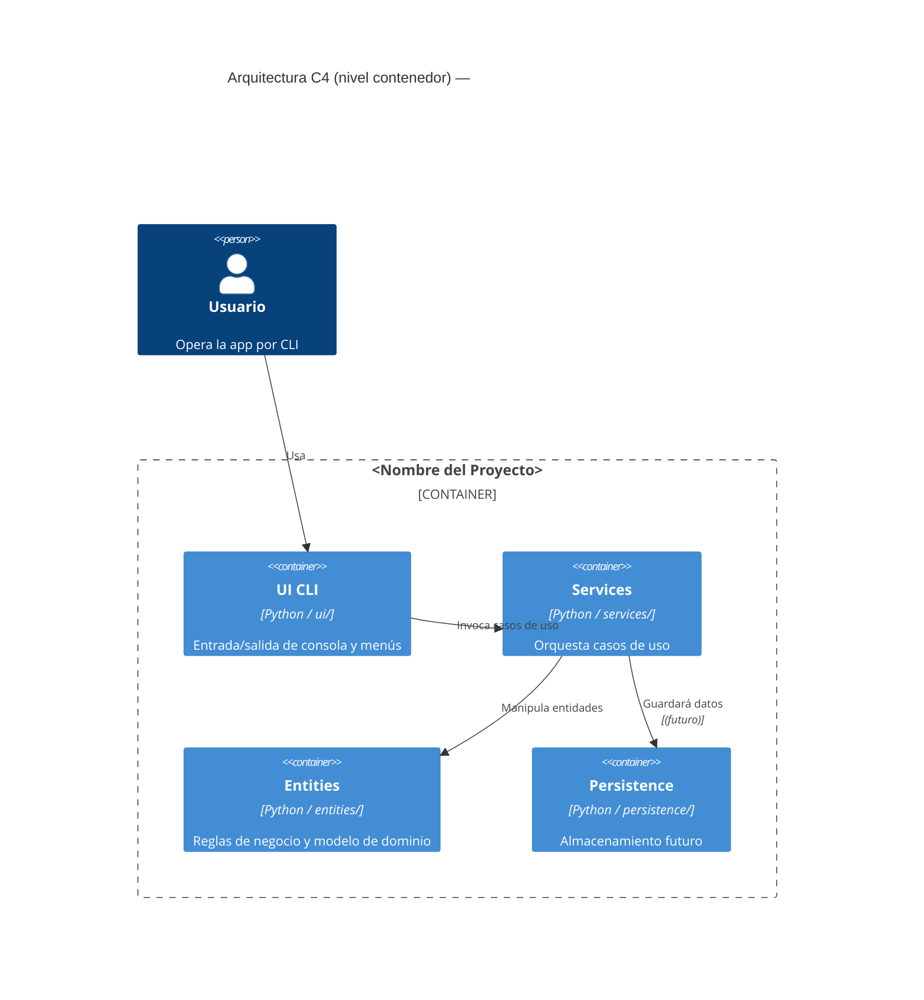

# Reglas — Diagramas Mermaid

Se activa automáticamente al editar `README.md`.
Aplica tanto al diagrama UML de clases como al diagrama C4 de arquitectura.

---

## Diagrama UML de clases (`classDiagram`)

### Plantilla base

### Reglas de este proyecto

1. **Visibilidad**: `-` para `__privado`, `#` para `_protegido`, `+` para público/property.
2. **Propiedades**: mostrarlas como atributos `+` sin paréntesis — son la interfaz observable.
3. **`Resultado`**: incluirlo siempre como clase separada con sus métodos `exito` y `error`.
4. **Herencia**: `Padre <|-- Hijo` (la flecha apunta al padre).
5. **Agregación/composición**: `o--` para agregación débil, `*--` para composición fuerte.
6. **Dependencias de retorno**: `..>` para indicar que una clase usa `Resultado`.
7. **Servicios y UI**: incluirlos sin atributos (solo nombre de clase) para mostrar la arquitectura completa.

### Ejemplo (Coches2026)

> En Coches2026: `EntidadBase` = `Coche`, `EntidadA` = `CocheCombustion`, `EntidadB` = `CocheElectrico`.

### Errores comunes a evitar

- ❌ `+atributo()` con paréntesis en una property → ✅ `+atributo tipo`
- ❌ Omitir `<<abstract>>` en clases abstractas
- ❌ No incluir `Resultado` como clase propia
- ❌ Mezclar inglés y español en nombres de elementos del diagrama

---

## Diagrama C4 de arquitectura (`C4Container`)

### Niveles relevantes

- **Nivel 2 – Contenedores**: las cuatro capas. **Este es el nivel habitual.**
- **Nivel 3 – Componentes**: solo si se detalla una capa concreta.

### Plantilla Nivel 2

### Reglas

1. **Nunca** dibujar flecha `ui → dominio`; viola la arquitectura.
2. `persistence` aparece siempre aunque esté vacía — comunica la intención arquitectónica.
3. Usar `Container_Boundary` para agrupar todas las capas dentro del sistema.
4. Sustituir `<Nombre del Proyecto>` por el nombre real del proyecto en cada diagrama.

### Errores comunes a evitar

- ❌ Usar `graph TD` en lugar de `C4Container`
- ❌ Omitir `persistence` del diagrama porque está vacía

