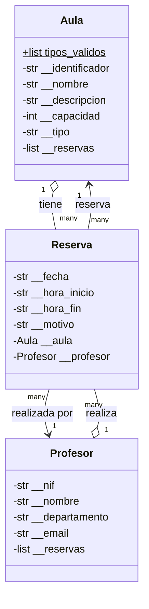

# Gestión de Aulas

Aplicación de consola en Python para gestionar la reserva de aulas en una escuela.
Permite registrar aulas y profesores, y gestionar las reservas de aulas por franja horaria,
garantizando que no se solapen dos reservas sobre el mismo aula.

Arquitectura de cuatro capas: `ui → services → entities → persistence`.

---

## Diagrama de clases

