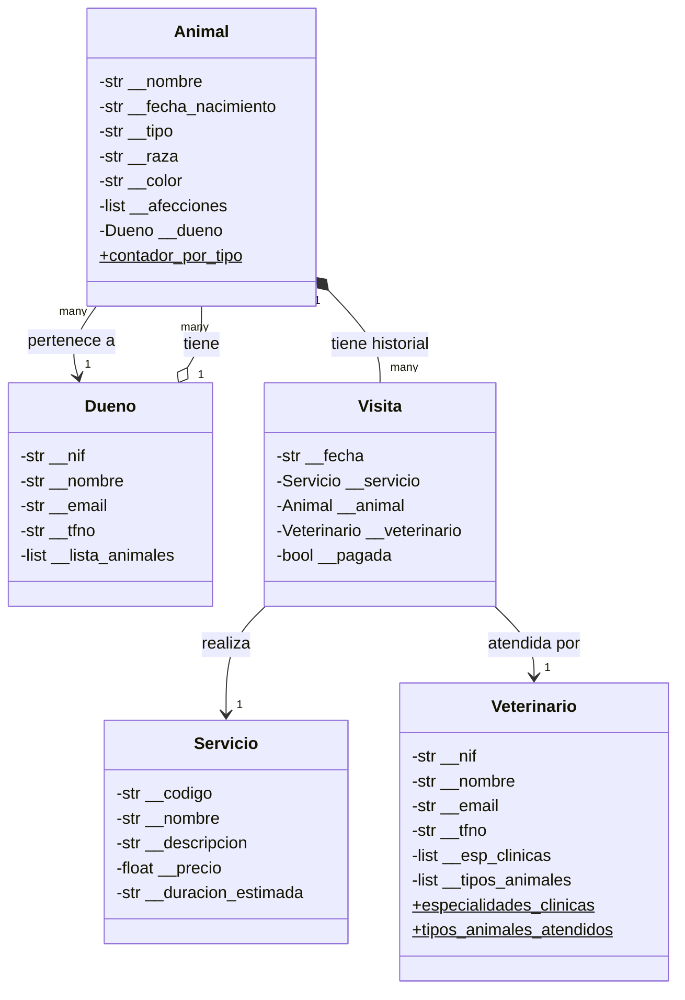

# Clínica Veterinaria

Aplicación de consola en Python para gestionar una clínica veterinaria.
Permite registrar dueños, animales y veterinarios, y llevar el historial de visitas asociadas a cada mascota con el servicio realizado.

Arquitectura de cuatro capas: `ui → services → entities → persistence`.

---

## Diagrama de clases

